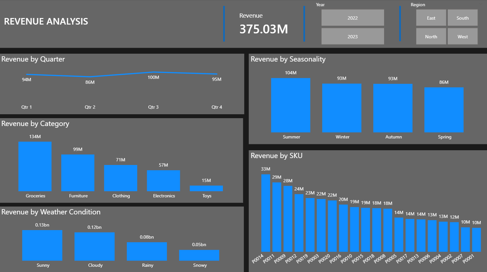
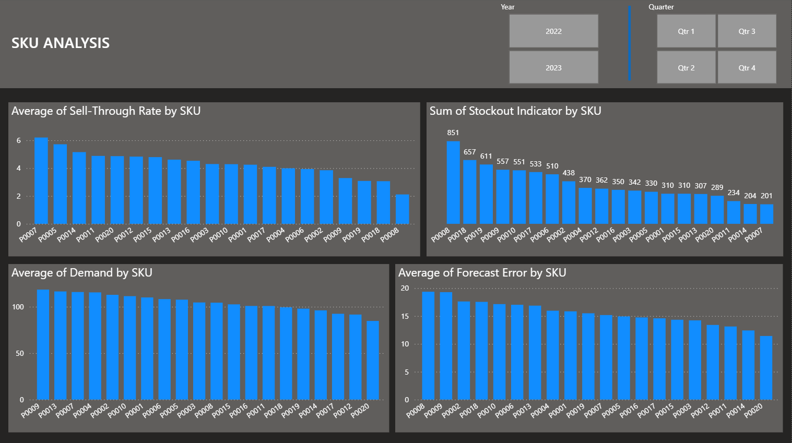
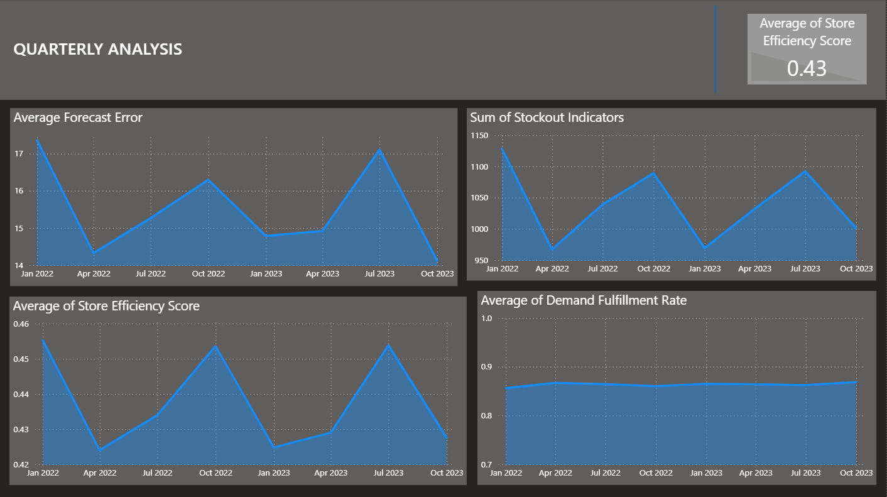

# Retail Demand Forecasting and Inventory Optimization

## Overview

This project analyzes multi-year retail sales and inventory data (2022–2023) to evaluate revenue performance, stockout risk, forecasting accuracy, and service level gaps.

The objective was to identify operational inefficiencies, quantify lost revenue opportunities, and develop data-driven recommendations to improve demand planning and inventory optimization.

---

## Business Problem

Retail operations were experiencing:

* Recurring stockouts across multiple SKUs
* Suboptimal service levels (~86% vs. 95% target)
* Forecast inaccuracies concentrated in specific quarters
* Revenue concentration across limited products and regions

This analysis investigates root causes and proposes corrective strategies.

---

## Key KPIs & Formulas

**Revenue**
`Revenue = UnitsSold × (Price − Discount)`

**Sell-Through Rate**
`SellThroughRate = UnitsSold / InventoryLevel`

**Stockout Indicator**
`StockoutRisk = 1 if UnitsSold ≥ InventoryLevel`

**Forecast Error**
`ForecastError = Demand − UnitsSold`

**Service Level (Demand Fulfillment Rate)**
`ServiceLevel = UnitsSold / Demand`

**Store Efficiency Score**
`Efficiency = UnitsSold / (InventoryLevel + UnitsOrdered)`

---

## Key Insights

### Revenue Performance

* Top 3 SKUs generated over $89M combined revenue.
* Groceries were the highest-performing category.
* Revenue peaked in Summer, followed by Winter and Autumn.
* Northern region contributed the highest revenue share.

---

### Inventory & Stockout Risk

* 3 SKUs (P0008, P0018, P0019) accounted for the most stockouts.
* Q1 (2022) had the single highest stockout occurrence.
* Q3 showed the highest average stockout rate across both years.
* Persistent stockouts across all 8 quarters indicate structural replenishment issues.

---

### Forecasting Accuracy

* P0008 and P0009 had the highest average forecast error.
* 4 of the top 5 forecast error SKUs were also top stockout SKUs.
* Forecast errors were highest in Q1 and Q3, indicating seasonal bias in planning.

---

### Demand Fulfillment Rate & Efficiency

* Average demand fulfillment rate remained steady at: **86%** (below 95% target).
* Store efficiency averaged 43%.
* Indicates lost sales, unmet demand, and supply chain inefficiencies.

### Commonalities

* Q2 2022 and Q3 2023 recorded the lowest stockout indicators and lowest average forecast error, suggesting stronger forecast alignment with actual demand during these periods.
* Despite improved forecast accuracy, store efficiency declined during these quarters, as well as in Q1 2023, indicating that inventory levels may have been increased beyond optimal levels to prevent stockouts.
* This pattern suggests a trade-off between service level improvements and inventory utilization, where excess stock may have reduced stockout risk but lowered operational efficiency.
  
---

## Business Insights

* Revenue for certain SKUs appears constrained by inventory limitations rather than weak demand.
* Forecast inaccuracy directly correlates with stockout frequency.
* Seasonal forecasting bias contributes to recurring Q1 and Q3 inefficiencies.
* Inventory policies likely underutilize safety stock optimization models.

---

## Recommendations

* Increase safety stock for high-stockout SKUs (P0008, P0018, P0019).
* Recalibrate forecasting models to address Q1 and Q3 seasonal error bias.
* Implement dynamic safety stock based on forecast variance.
* Improve service level tracking with real-time inventory dashboards.
* Optimize regional inventory allocation based on revenue concentration.

---

## Tools & Technologies

* Power BI (Dashboard & KPI Visualization)
* Excel / Data Modeling
* Statistical KPI Analysis
* Forecast Error & Inventory Metrics Modeling

---

## Dashboard Features

* Revenue by SKU, Region, and Season
* Stockout Analysis (SKU × Quarter)
* Forecast Error Trend Analysis
* Service Level Tracking
* Store Efficiency Comparison

---

## Impact

This project demonstrates end-to-end supply chain analytics, including:

* Revenue performance evaluation
* Inventory optimization modeling
* Forecast accuracy analysis
* Service level gap identification
* Executive-level business recommendations

---

